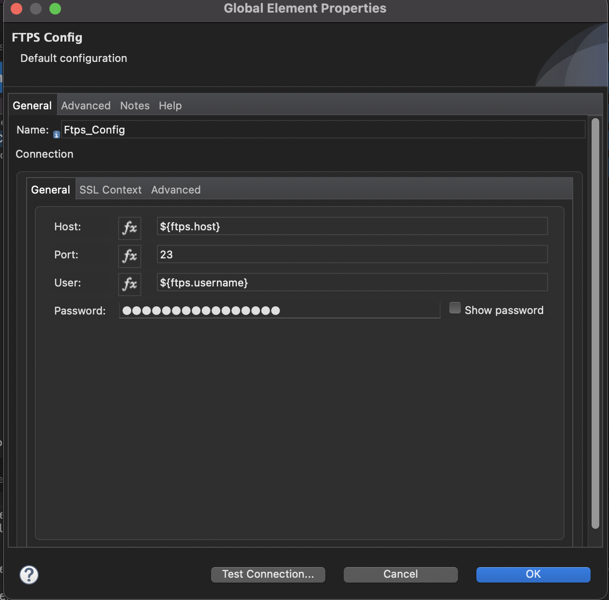
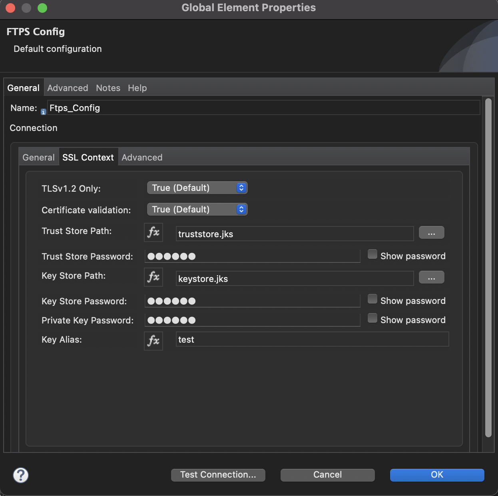
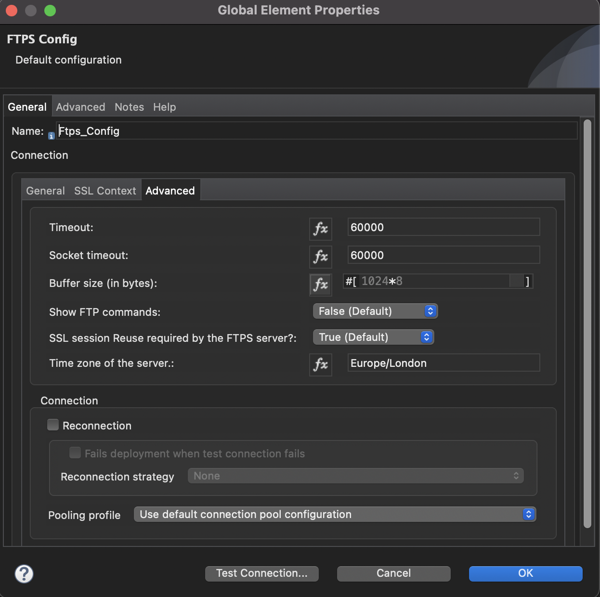
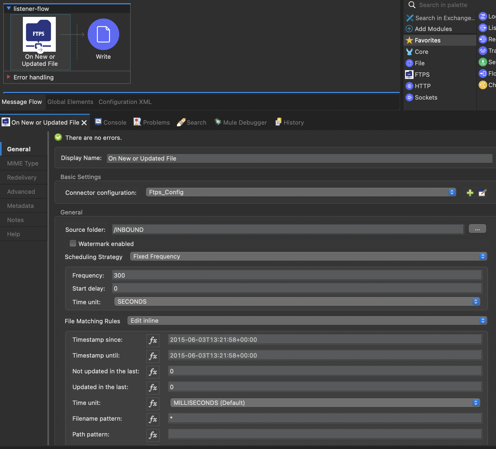
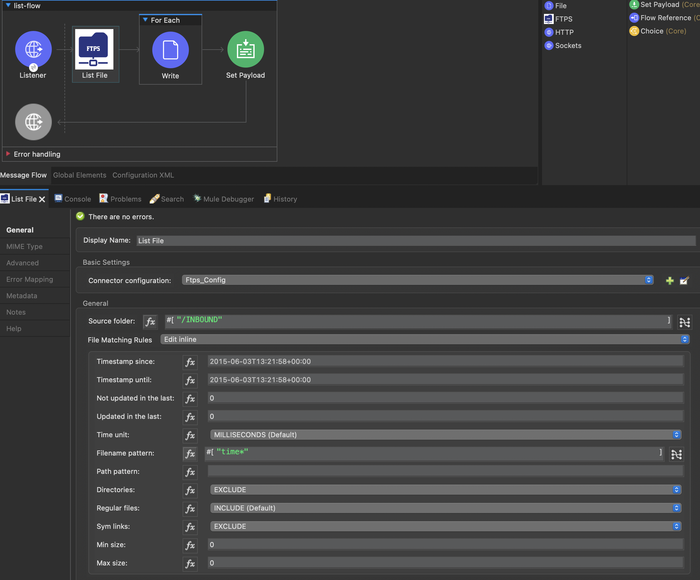
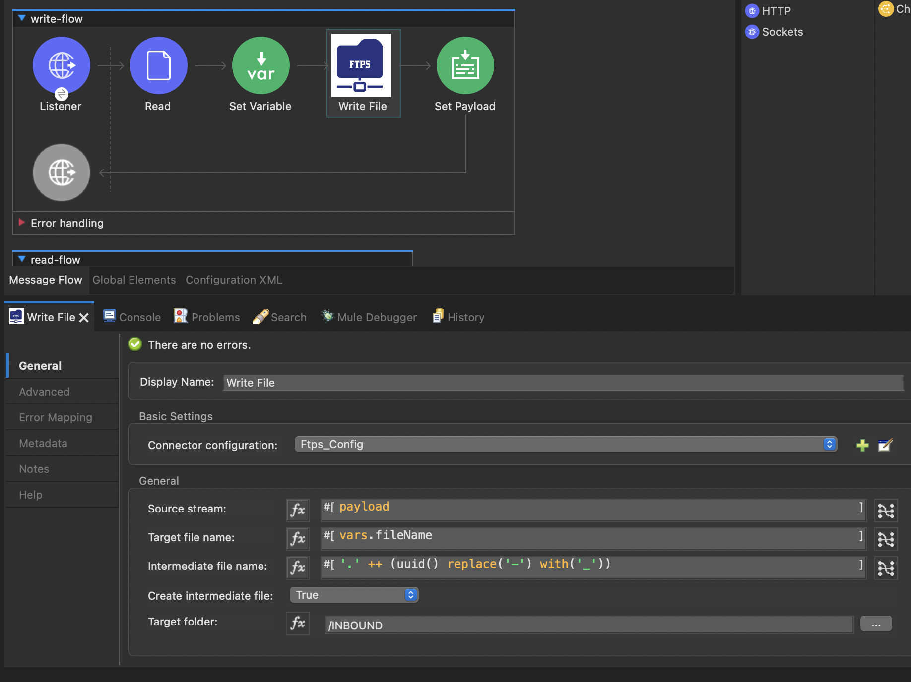
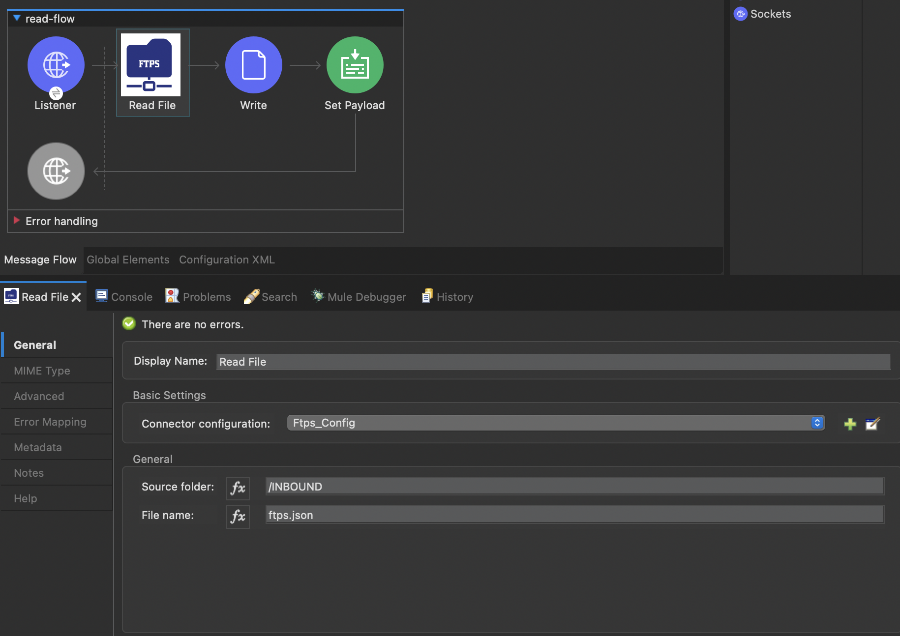
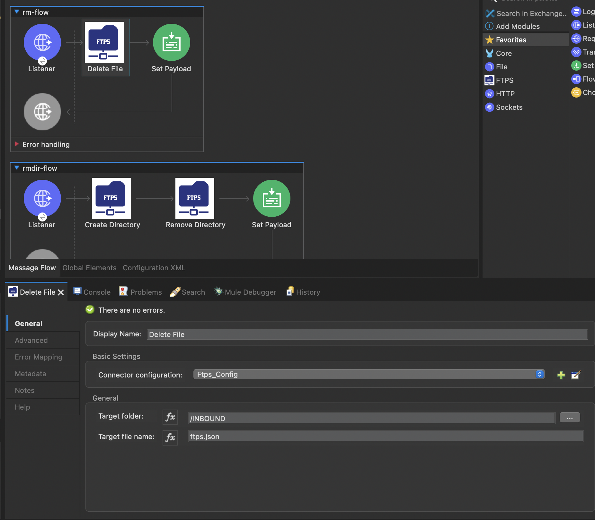

# Mule FTPS Connector

### What is FTP?
> [From wikipedia](https://en.wikipedia.org/wiki/File_Transfer_Protocol) The File Transfer Protocol (FTP) is a standard communication protocol used for the transfer of computer files from a server to a client on a computer network. FTP is built on a client–server model architecture using separate control and data connections between the client and the server.[1] FTP users may authenticate themselves with a clear-text sign-in protocol, normally in the form of a username and password, but can connect anonymously if the server is configured to allow it. For secure transmission that protects the username and password, and encrypts the content, FTP is often secured with SSL/TLS (FTPS) or replaced with SSH File Transfer Protocol (SFTP)

### What is FTPS
> [From wikipedia](https://en.wikipedia.org/wiki/FTPS): FTPS (also known FTP-SSL, and FTP Secure) is an extension to the commonly used File Transfer Protocol (FTP) that adds support for the Transport Layer Security (TLS) and, formerly, the Secure Sockets Layer (SSL, which is now prohibited by RFC7568) cryptographic protocols.
> FTPS should not be confused with the SSH File Transfer Protocol (SFTP), a secure file transfer subsystem for the Secure Shell (SSH) protocol with which it is not compatible. It is also different from FTP over SSH, which is the practice of tunneling FTP through an SSH connection.

### FTPS vs SFTP
> The key distinguishing feature of `SFTP` and `FTPS` protocols is the underlying transport mechanism. While FTPS affixes an additional layer to the legacy FTP protocol, SFTP essentially acts as an extension to the `SSH` protocol. This means that both transport protocols do not share any association but exist to initiate a transfer of files between systems.

>> <b>FTPS:</b> `data channel` and `command channel` are used as two separate channels for facilitating exchanges on the FTPS protocol.
>> The command channel has the role of managing simple command exchanges between server and FTP client by usually running on server 21 port.
>> Accordingly, the data channel works by employing on-demand temporary ports that are listening on the client (active mode) or the server (passive mode). This channel holds the responsibility of data exchange in terms of file transfers or directory listings.

>> <b>SFTP:</b> SFTP does not make use of distinct data and command channels. Transfer within SFTP takes place through the means of a single connection through uniquely formatted packets.

### FTPS
MuleSoft is a java based application, so we will require Java `FTP/FTPS` client library to connect to a file share using `FTP` protocol. Based on various research, I have found that [Apache common Net's FTPS Client](https://commons.apache.org/proper/commons-net/) is the most upto date and actively maintained by Apache. There are many other commercial library which you can choose from but since I am making a community connector, I am sticking with the Apache library.

### Available connectors to choose from
Based on my knowledge there is only one [Mule FTPS Connector](https://docs.mulesoft.com/ftps-connector/1.6/) created and supported by MuleSoft. But the connector is a premium one and part of the B2B package. It means, anyone wants to use the MuleSoft's FTPS connector will require to buy its license separately.

[Mule FTPS Connector](https://docs.mulesoft.com/ftps-connector/1.6/) connector is highly recommanded if the organisation can sepend little extra as it provide complete support of the protocol and production tested in many organisations.

### Why create this connector?
The main reason to create this connector is to provide a community alternative option to the MuleSoft's paid connector. I will try my best to keep it upto date with any fixes and upgrade when Apache common net upgrade.


### User Guide

<b>Build your own</b>
> 1. Clone the [repo](git@github.com:Neo-Integrations/ftps-connector.git)
> 2. Change to the project directory - `cd ftps-connector`
> 3. To install the connector to the local maven repo, run `mvn clean install`.
> 4. Then include the below dependency in your Mule project to start using the connector:
> ```
>  <dependency>
>    <groupId>org.neointegrations</groupId>
>    <artifactId>ftps-connector</artifactId>
>    <version>1.0.8</version>
>    <classifier>mule-plugin</classifier>
>  <dependency>
>    ```
> 5. If you would like to deploy the connector to a maven repo, please include the distribution management in the pom.xml and publish to the maven artifact.

<b>Use the binary directly from maven repo</b>
> 1. First add following maven repository in your pom.xml's repository section
> ```xml
> <repositories>
> ...
> <repository>
>  <id>maven-public</id>
>  <url>https://pkgs.dev.azure.com/NeoIntegration/MuleSoft/_packaging/mvn-public/maven/v1</url>
>  <releases>
>     <enabled>true</enabled>
>  </releases>
>  <snapshots>
>     <enabled>true</enabled>
>  </snapshots>
> </repository>
> ...
> </repositories>
> ```
> 2. Add following server details in your `$M2_HOME/settings.xml`. Replace `[PERSONAL_ACCESS_TOKEN]` with the actual password. Please [contact](mailto:aminul1983@gmail.com) me if you would like to get a token.
> ```xml
>   <servers>
>   ...
>    <server>
>      <id>maven-public</id>
>      <username>NeoIntegration</username>
>      <password>[PERSONAL_ACCESS_TOKEN]</password>
>    </server>
>    ...
>  </servers>
> ```
> 3. Thats it, you can start using it now.

### How to use the operations
#### Config
```xml

<ftps:config name="Ftps_Config" doc:name="Ftps Config"
    doc:id="75bcfcf1-20dc-485a-bd1a-9ebe5780d72d">
    <ftps:connection user="${USER_NAME}" password="${PASSWORD}"
        host="163.172.147.233" port="23" timeout="60000"
        socketTimeout="120000" bufferSizeInBytes="#[1024*8]"
                     enableCertificateValidation="true" debugFtpCommand="false"
                     sslSessionReuse="true" serverTimeZone="Europe/London"
                     tlsV12Only="true" trustStorePath="truststore.jks" 
                     trustStorePassword="123456" keyStorePassword="123456" 
                     keyPassword="123456" keyAlias="test" keyStorePath="keystore.jks"/>
</ftps:config>
```
Where
- `sslSessionReuse:` Default is `true`. If the FTPS server does not support it set it to `false`. Most of the modern FTPS server reuse TLS session for better security. There is a existing issue raised on the [Apache FTPS client](https://issues.apache.org/jira/browse/NET-408) which presents it reusing SSL session. I have implemented a solution taken from cyberduck library which has fixed the issue for jdk1.8 If you are using JDK11 or above, the solution will not work. Please raise a issue in this repo if anyone is using jdk11 or above then I will create a seperate release for that. Please note, it is important to pass a system property to the Mule application for the TLS session share to work in JDK8u161 or above java version. 
  - Using studio VM argument `-M-Djdk.tls.useExtendedMasterSecret=false`
  - Using java: `System.setProperty("jdk.tls.useExtendedMasterSecret", "false");`
  - MuleSoft runtime manager property windows pass the =`jdk.tls.useExtendedMasterSecret` and value=`false`
- `serverTimeZone:` Set the FTPS server's time zone. Default is `Europe/London`.
- `timeout:` Connection timeout in `milliseconds`. Make sure to give ample time for the client and server to setup a TLS connection. 60000 (60 seconds) is recommended.
- `socketTimeout:`  Socket read or write timeout in `milliseconds`. The connector has been designed to reconnect when the connection become stale, but I would still advise to keep the timeout not very large and not very small. I would suggest no bigger than 1 hour timeout and no lesser than 5 minutes
- `enableCertificateValidation:` Set it to `false` to disable certificate validation. It is useful for development testing where server presents self-signed certificate. It is strongly recommanded to set it to `true` for production environment
- `debugFtpCommand:` Always keep the default `false`. Setting the value `true` will print the FTP commands exchange between the client and the server.
- `tlsV12Only`: For better security set it to `true` which will enforce `TLSv1.2`. Please make sure that the FTPS server does support `TLSv1.2`, otherwise set this field to `false`. When set to false, client and server negotiate the TLS version. TLSv1.3 support can be added latter
- `bufferSizeInBytes`: Default buffer size is 8KB. You can tune the socket buffer size using this parameter. 
- `trustStorePath` and `trustStorePassword`: These two property lets you inject an external truststore. You can provide an absolute path of the truststore file or it can be placed in the classpath. Both the property must be supplied to be able to add the truststore. In its current implementation, it only supports 'JKS' keystore. I will add support for `PKCS#12` and `JCEKS` keystore.
- `keyStorePath`, `keyStorePassword`, `keyPassword`, and `keyAlias`: These 4 properties lets you inject an external keystore. This will be useful to enable `mTLS`(2-way TLS) with the FTPS server. You can provide an absolute path of the keystore file or it can be placed in the classpath. All the 4 properties must be supplied to be able to add the keystore. In its current implementation, it only supports 'JKS' keystore. I will add support for `PKCS#12` and `JCEKS` keystore.
- 





#### As a listener
This is the most standard operation, use the FTPS connector to scan a folder for any new files or update to an existing file.
```xml	
<flow name="listener-flow" doc:id="22be816a-b834-4a3a-a677-e667a90d2a56" initialState="stopped">
    <ftps:ftps-listener doc:name="On New or Updated File" doc:id="70b843fa-c14a-4dd0-b5f7-dab7052f5181" 
    config-ref="Ftps_Config" sourceFolder="/INBOUND" autoDelete="true" applyPostActionWhenFailed="false">
        <scheduling-strategy >
            <fixed-frequency frequency="300" timeUnit="SECONDS"/>
        </scheduling-strategy>
        <ftps:predicate-builder filenamePattern="*"/>
    </ftps:ftps-listener>
    <file:write doc:name="Write" doc:id="f7189dec-aeee-49cd-9d4c-4b179e97cd04" path="#['tmp/' ++ attributes.name]"/>
</flow>
```



#### To list files
```xml
<flow name="list-flow" doc:id="7c085990-520f-46bb-be45-03123f76cbdb" >
    <http:listener doc:name="Listener" doc:id="6ece8999-74de-469b-a0b1-794442ce9b97" config-ref="HTTP_Listener_config" path="/list"/>
    <ftps:list doc:name="List File" doc:id="31686d10-e220-46de-825e-53028262cbe2" sourceFolder='#["/INBOUND"]' config-ref="Ftps_Config" deleteTheFileAfterRead="false">
        <ftps:matcher filenamePattern='#["time*"]' directories="EXCLUDE" symLinks="EXCLUDE"/>
    </ftps:list>
    <foreach doc:name="For Each" doc:id="ca7a3e6f-fc5f-4e90-9679-1d932fac7e1f" collection="#[payload]">
        <file:write doc:name="Write" doc:id="aee35f90-542d-4c21-a083-74b0733912be" path="#['tmp/' ++ attributes.name]"/>
    </foreach>
            <set-payload value="#[true]" doc:name="Set Payload" doc:id="50509215-a64f-42dc-9880-9ee1cee59a42" />
    <error-handler >
        <on-error-continue enableNotifications="true" logException="true" doc:name="On Error Continue" doc:id="c0928cdd-449c-4027-8bea-ec7b03ce7ac5" >
            <set-payload value="#[false]" doc:name="Set Payload" doc:id="cf9bda6a-552e-4589-8643-e49beddcb254" />
        </on-error-continue>
    </error-handler>
</flow>
```


#### To write file

```xml
<flow name="write-flow" doc:id="df1f6bcf-9f17-4789-8833-b8995d1d05a0" >
    <http:listener doc:name="Listener" doc:id="f32d5217-dd3b-42e8-9f9f-b761beb3cae3" config-ref="HTTP_Listener_config" path="/write"/>
    <file:read doc:name="Read" doc:id="29ec7888-a585-4ae4-a0a3-d84d5501cf9b" path="tmp/file.json"/>
    <set-variable value="#[attributes.fileName]" doc:name="Set Variable" doc:id="41be58fc-e3f5-44c0-a73b-7ff95d8757be" variableName="fileName"/>
    <ftps:write doc:name="Write File" doc:id="ea68e268-d791-4f7b-ad5a-378f430700a5" config-ref="Ftps_Config" targetFolder="/INBOUND" overwriteFile="false" targetFileName="#[vars.fileName]" createIntermediateFile="true"/>
        <set-payload value="#[true]" doc:name="Set Payload" doc:id="c208355c-b43b-431e-ab4f-5d5a72d4d993" />
    <error-handler >
        <on-error-continue enableNotifications="true" logException="true" doc:name="On Error Continue" doc:id="276e2c79-a021-4d4a-b651-511377ba3fff" >
            <set-payload value="#[false]" doc:name="Set Payload" doc:id="c9d1d899-4fc2-485c-8dcf-f866abec6751" />
        </on-error-continue>
    </error-handler>
</flow>
```


#### To read file
```xml
<flow name="read-flow" doc:id="033d76b9-0da4-4d6a-aa5a-4d1faa96ff8a" >
    <http:listener doc:name="Listener" doc:id="82420c2c-563e-40e4-8e69-e3dab8ce3197" config-ref="HTTP_Listener_config" path="/read"/>
    <ftps:read doc:name="Read File" doc:id="c90602c8-b414-48a5-b651-52a726499847" config-ref="Ftps_Config" sourceFolder="/INBOUND" fileName="ftps.json"/>
    <file:write doc:name="Write" doc:id="c49daaaa-2dcc-41bc-826b-469c15a4dab1" path="#['tmp/' ++ attributes.name]"/>
        <set-payload value="#[true]" doc:name="Set Payload" doc:id="7be8cd0c-e465-4165-a9a9-f63099f92c76" />
    <error-handler >
        <on-error-continue enableNotifications="true" logException="true" doc:name="On Error Continue" doc:id="ca454846-fac8-4ec8-84d1-b30445df2d01" >
            <set-payload value="#[false]" doc:name="Set Payload" doc:id="2c38baac-27d7-4e6f-86cc-6a009588bf89" />
        </on-error-continue>
    </error-handler>
</flow>
```


#### To delete file

```xml
<flow name="rm-flow" doc:id="98096bba-c988-4340-8c4e-9c4a87415b43" >
    <http:listener doc:name="Listener" doc:id="1f39175a-574c-4dd1-b6df-f295d8548cae" config-ref="HTTP_Listener_config" path="/rm"/>
    <ftps:rm-file doc:name="Delete File" doc:id="72466294-de52-4af5-8e45-4be27a4ab137" targetFolder="/INBOUND" targetFileName="ftps.json" config-ref="Ftps_Config"/>
        <set-payload value="#[true]" doc:name="Set Payload" doc:id="38a7dc23-478d-402f-82f0-acd2e75d4580" />
    <error-handler >
        <on-error-continue enableNotifications="true" logException="true" doc:name="On Error Continue" doc:id="c387a297-b35b-4e2c-9bac-5f5dec18166d" >
            <set-payload value="#[false]" doc:name="Set Payload" doc:id="a11df3b1-4907-47d1-91f8-4199f561c158" />
        </on-error-continue>
    </error-handler>
</flow>
```


### Advance options


### References
- [Apache Common Net](http://commons.apache.org/proper/commons-net/)
- [FTP Specification](https://datatracker.ietf.org/doc/html/rfc959)
- [FTPS Specification](https://datatracker.ietf.org/doc/html/rfc4217)


## Support
- The connector was created with the best effort basis. I would suggest anyone thinking of using this connector, to test it appropriately.
- You can raise any issue with the connector through issue tab, I will try to address them as quickly as I can.
